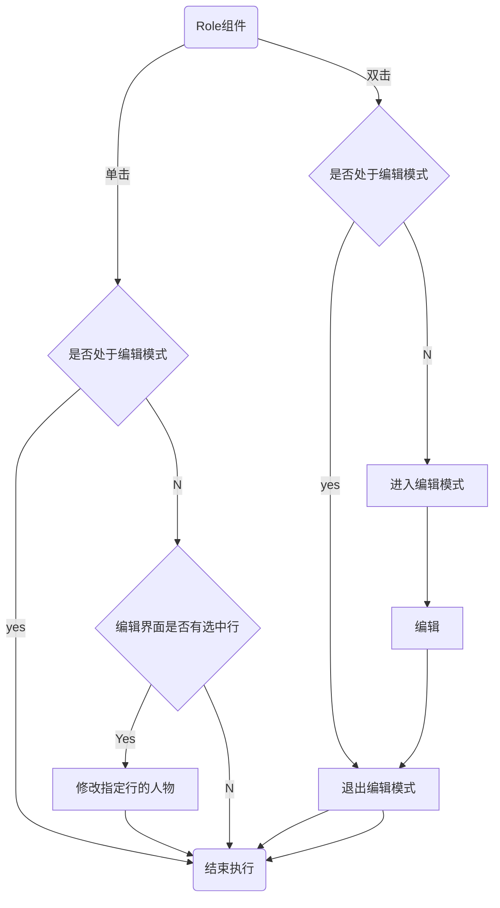
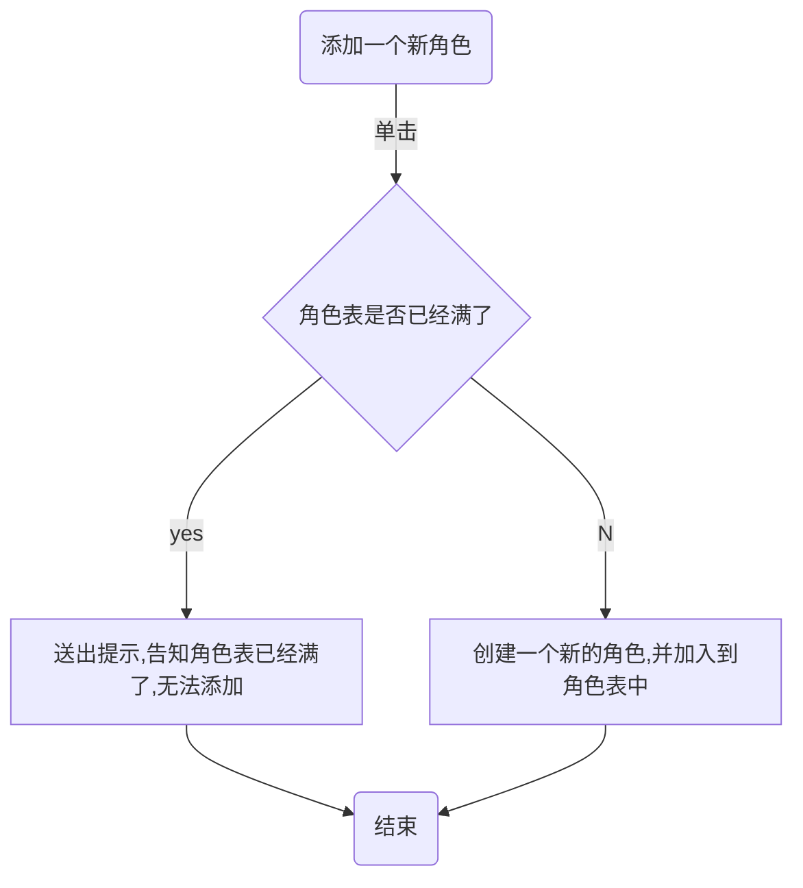
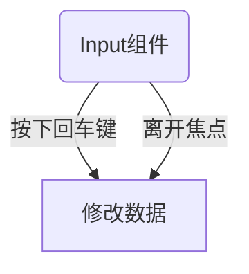

### 角色事件的处理

```mermaid
flowchart TD
start(Role组件) --单击-->
isEditor{是否处于编辑模式} --yes-->
flowEnd(结束执行)

isEditor --No-->
haveTarget{编辑界面是否有选中行} --Yes-->
changePerson[修改指定行的人物] -->
flowEnd

haveTarget --No-->flowEnd

start --双击-->
dbIsEditor{是否处于编辑模式} --yes-->
outEditor[退出编辑模式] -->
flowEnd

dbIsEditor --No-->
intoEditor[进入编辑模式] -->
editor[编辑] -->
outEditor -->
flowEnd
```
### 添加角色按钮事件处理

```mermaid
flowchart TD
start(添加一个新角色)--单击-->
isFull{角色表是否已经满了} --yes-->
alertFull[送出提示,告知角色表已经满了,无法添加] -->
flowEnd(结束)

isFull --No-->
createNew[创建一个新的角色,并加入到角色表中] -->
flowEnd
```
### Input组件的设计

```mermaid
flowchart TD
start(Input组件)--按下回车键-->
changeValue[修改数据]

start--离开焦点-->
changeValue
```